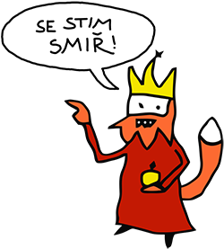

# Poznatky ke správnému vypracování úloh z měření

## Proč to vlastně musíme dělat?

Jde o jednu z nejčastěji pokládaných otázek studenta třetího na průmyslovce. (pokud víte o jiné, nebojte se vytvořit pull request a přidat ji do tohoto odstavce!)

Klíčovým důvodem, proč meření děláme, je mít možnost si v praxi dokázat teorii, kterou již tři roky probíráme a počítáme. Samozřejmě, že toto tvrzení je jen zástěrka a skutečných důvodů je několik:
- **Pečlivost, přesné dodržení zadání a jasně daných postupů**. Vlastně poprvé se setkáváme se způsobem zadávání práce, který se v budoucnu už bohužel nezmění (maturitní práce, vysoká škola, zaměstnání). Máme jasně dané vstupy, postupy a požadovaný cíl (nic víc ani míň). Je potřeba se s tím smířit a ne bojovat.
- **Formátování**. Naučit se striktně dodržovat požadované formátování. Více než buzerace to je příprava na maturitní práci. A maturitu chceme, že jo?
- **Práce s editorem rovnic ve Wordu**. Výraz zapsaný jako `f0=(1/2*pi)*odmocnina((L*C)^(-1))` patří někam do programu, ale ne do odborné (za rok maturitní) práce. Špatně se to čte a navíc v tom lze snadno něco přehlédnout, čili udělat chybu. Zbytečně za to letí body dolů za nečitelnost.
- **Příprava na maturitu**. Elektrotechnika je zhruba polovina z 25 otázek maturitního předmětu Hardware. Pokud si tyto úlohy poctivě vypracujeme (**a skutečně si budem psát, jak jsme to dělali a jak se obvod choval!!!**), tak máme polovinu učení za sebou a to se vyplatí ne? Při učení na maturitu se pak stačí už jen podívat na vlastní vypracované úlohy a není potřeba hledat někde na internetu nebo v prezentacích.

Pokud vám vyučující protokol vrátí na přepracování, tak to má svůj důvod (opravdu chceme, abyste se naučili dělat práci tímto způsobem). Nebojujte s tím, smiřte se s tím. Tenhle repozitář vám má pomoct, stačí trochu snahy a věnovat tomu čas. Zvládli jsme to (skoro) všichni. Malá rada na závěr - lehčí už to nikdy nebude :disappointed:

## Formátování ve Wordu

Platí několik pravidel, které využijete i při psaní ročníkové / maturitní práce na průmyslovce. Ovšem je **vždy potřeba se zajímat o požadované formátování**. Každá instituce může vyžadovat jiné. Nelze tedy říct, že to či ono je správné. Vždy je potřeba si zjistit zadání a jím se pevně řídit.

Vždy je ale potřeba dodržovat jednotnou podobu. Platí nepsané pravidlo, že když už to máte blbě, tak aspoň ať i vše ostatní máte taky stejně blbě. :blush: **Bude to samozřejme pořád blbě, ale aspoň to bude vypadat o trošku líp než jenom blbě.**

**Pro protokoly (a zhruba celou průmyslovku platí):**
- Velikost základního písma 12 bodů
- Zarovnání do bloku
- Řádkování 1.5
- Odstavce oddělovat odsazením prvního řádku (pod nadpisem není co oddělovat - neodsazuje se!, samostatný odstavec taky ne)
- Tím že odsadíš odstavec, tak se už nevynechává řádek (nikdy se to nekombinuje)
- Za tečkou, čárkou a podobně se vždy dělá mezera
- Rovnice, jednotky, vzorce vždy editorem rovnic
- Jednotky editorem rovnic, ale zrušit kurzívu
- V číselném seznamu spíš nedávat tečky
- Pozor na spojovník a pomlčku (ano, jsou to dvě rozlišné věci)
- Nenechávat předložky na konci řádku (není to gramatická chyba, ale hůř se to čte, může se přehlédnout)
- Na konci stránky nesmí být samostatný nadpis, první nebo poslední řádek odstavce (raději vložit na další stránku a na té původní nechat místo)
- Při tisku doporučuji jednostránkově (čili zadní strana bude prázdná = učitelé z toho dělají papíry na písemky)
- Jednotky zapisovat do hranatých závorek! (nikoli kulatých)
- **Veličiny kurzívou, jednotky ne!**

### Co se zadáním?

Zadání stačí zkopírovat a řádně naformátovat.

### Jak psát teorii?
- Při prvním výskytu veličiny v teorii uvést i jednotky, pak už je to zbytečné
- Velmi stručně základní kontext k měření, aby až se z toho budeš učit k maturitě, tě to trochu probudilo, shrnout problematiku, je to především učení pro tebe
- Ideálně i věci nebo problémy, které na měření navazují

### Odpovědi na otázky
Ideálně zpracovat i postup jak se k tomu došlo, ať si to při učení na maturitu logicky odvodíš

### Schéma zapojení
Schéma stačí zkopírovat a řádně naformátovat

### Použité měřící přístroje a pomůcky
Prázdné řádky v tabulce raději proškrtávat, vypadá to líp a nemůže se stát, že tam někdo něco náhodou nechá dopsat

### Popis práce
- Popis práce vždy stručně a členit do vět a odstavců jako u zkoušky, když se zeptají, jak měření probíhalo, jak se pracovalo s přístroji, jak se nulovaly apod.
- Popsat co tě překvapilo, případně chyby a opravit postup pokud byl během měření špatně

### Graf
- V případě potřeby se nebát stránku orientovat na šířku a na více grafů využít více listů papíru
- Grafy musí být především čitelné a estetické
- Místo barevného provedení raději volit černobílé a pro různé skupiny bodů místo barvy nastavit odlišný tvar
- Pokud to měření vyžaduje, tak z jednotlivých bodů sestavit linii trendu v závislosti na předpokládaném průběhu (lineární průběh, či aproximovat)

### Tabulky
- V případě potřeby se nebát stránku orientovat na šířku a na více tabulek využít více listů papíru
- Důležitá je čitelnost a estetika
- Hodnoty i veličiny zapisovat editorem rovnic
- Pro spokojenost vyučujícího všechny hodnoty zapisovat ideálně na 4 platné číslice
- Některá měřící zařízení 4 platné číslice prostě neumí, co se dá dělat. Pro maximální spokojenost vyučujícího si zbylé platné číslice vymyslete
- Pokud to smysluplnost dovolí, vždy zapisovat v exponenciálním tvaru (1.234 * 10^3)
- Pokud je jedna veličina měřená víckrát, je dobré zapsat více hodnost a poté udělat průměr, tyto hodnoty zapsat a vypočítat jejich odchylku

### Výpočty
- Pro každý výpočet jeden příklad
- Odvození vzorců spíš nechat do teorie
- Pro maximální spokojenost vyučujícího udělat i kontrolu jinou měřící metodou pokud lze

### Spolupracovali
Bez komentáře.

### Závěr
- Velmi důležité porovnat očekávání, teorii, praxi
- Co tě překvapilo, zda hodnoty sedí (teorie; zkouška jinou měřící metodou; laická kontrola - extrémně velké proudy, napětí...)
- Rozdíli v naměřených hodnotách, nepřesnost přístrojů
- Očekáváné/neočekávané situace, komplikace
- Zda byly splněny všechny úkoly ze zadání
- Co práce přinesla
